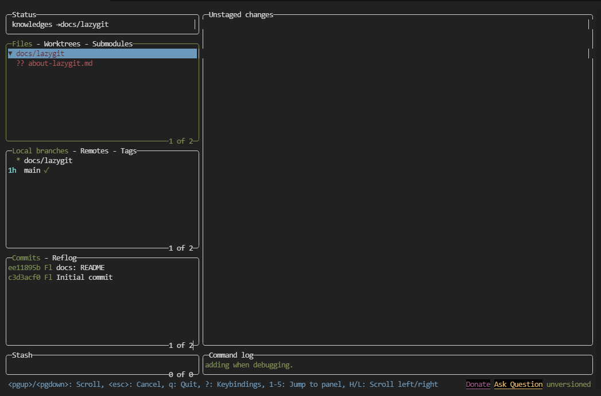

# lazygit とかいう神ツールについて

lazygit は CLI 上から Git を操作することのできる TUI ソフトです。\
このソフトを使うと、Git を操作するときにコマンドではなく TUI から操作できます。（一部の複雑な操作は CLI からじゃないとできないけど）

## インストール方法

公式の[README](https://github.com/jesseduffield/lazygit#installation)を参考にしてみてください。\
OS や使用しているパッケージマネージャーによっても異なります。

## 簡単な使用方法

- ターミナルから`lazygit`を実行すると起動できます。このとき、カレントディレクトリに`.git`ディレクトリがない場合、ディレクトリを初期化するかという確認が出ます。

- **TAB**キーでグループ間の移動・スペースで選択・**Shift + P**でプッシュ・**p**でプルが実行されます。
- **Files**のタブにして、**Space**でファイルをインデックスに追加(`git add`)・**c**でコミットをすることができます。
- **Local Branches**のタブで**n**を押すと、新しいブランチを作成できます。**d**ではブランチを消すことができます。

詳しくは[README](https://github.com/jesseduffield/lazygit)を見てみてください。

## Lazygit の便利な機能

### Stash

Files で `Shift+S` を押すといろいろな設定で stash することができます。(ファイル全部 stash したり、stage した/してない変更だけやるとか)

### Custom Patch

過去のコミットの変更を一部引っ張ってワーキングツリーに持ってくることができます。

1. `Commits` 等でファイルの diff を Diff セクションに出す
2. `Enter` で Diff セクションに入って、変更を部分的にステージングするときみたいに Space 等で Custom Patch に変更を入れる
3. `Files` で `Ctrl+P` を押して適用する

ただ適用するだけではなく、いろいろなことができます:

## まとめ

めっちゃ効率上がる（特にファイルを追跡するときとかは）ので入れてみるのをおすすめします。ただ、rebase とかは CLI からやったほうが楽かもしれない。
